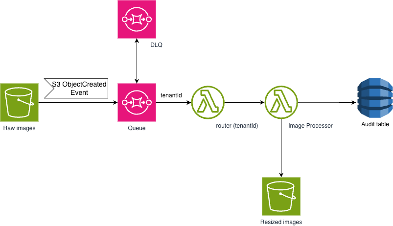

# poise-image-processor
Image processor for generating vehicle thumbnails.

## Architecture



```
Upload image to S3 (raw bucket)
  key:      {dealerId}/{vehicleId}/{filename}
  metadata: x-amz-meta-target-size=800x600
            x-amz-meta-target-format=webp
        |
        v
S3 ObjectCreated event -> SQS queue
        |
        v
Lambda (handler)
  1. Parse S3 key  -> dealerId / vehicleId / filename
  2. Read metadata -> target-size / target-format
  3. Check S3 for output key (idempotency gate)
  4. Download raw image
  5. Resize with Pillow
  6. Upload to thumbnails bucket
  7. Persist record to DynamoDB
        |
        v
Thumbnails bucket: {dealerId}/{vehicleId}/{filename-base}/{size}.{format}
DynamoDB: audit record per processed variant
```

### Message properties

| S3 object attribute | Value | Example |
|---|---|---|
| S3 key | `{dealerId}/{vehicleId}/{filename}` | `dealer42/vehicle99/front.jpg` |
| User metadata | `x-amz-meta-target-size` | `800x600` or `800` (auto-height) |
| User metadata | `x-amz-meta-target-format` | `webp` · `jpeg` · `png` |

### Idempotency

The output S3 key is **deterministic**: `{dealerId}/{vehicleId}/{filename-base}/{size}.{format}`.
Before any processing the Lambda does a `HeadObject` on that key. If it already exists
the message is silently skipped — re-delivering the same SQS message is safe.

### Concurrency

| Assumption | Value |
|---|---|
| Dealers on platform | ~10,000 |
| Active dealers (50%) | 5,000 |
| New cars registered per dealer per day | 10 |
| Photos per car | 20 |
| **Total photos/day** | **1,000,000** |

Assuming all uploads are concentrated at a **1-hour peak window**:

```
1,000,000 photos / 3,600 s ≈ 278 photos/second
```

Each resize takes ~500 ms (measured). Applying [Little's Law](https://en.wikipedia.org/wiki/Little%27s_law):

```
concurrency = arrival_rate × avg_duration
            = 278 req/s × 0.5 s
            = ~139 concurrent executions
```

139 concurrent executions is within Lambda's default account limit of 1,000, but high enough to risk starving other Lambda functions in the account during peak.  
**Setting reserved concurrency to ~150 is recommended** to cap this function's footprint and protect the rest of the account.

### Multi-tenancy

Each dealer (tenant) must be isolated from others during image processing to prevent cross-tenant state leakage in shared Lambda execution environments.

#### Architecture

```
S3 (raw upload)
  │  ObjectCreated notification
  ▼
SQS Standard (intake queue)
  │  batch_size = 10
  ▼
Router Lambda                       ← extracts dealer_id from S3 key
  │  TenantId = dealer_id
  │  InvocationType = Event (async)
  ▼
Image Processor Lambda              ← isolated per dealer (Tenant Isolation Mode)
```

#### How it works: Lambda Tenant Isolation Mode

The Router Lambda invokes the Image Processor Lambda directly via `lambda:InvokeFunction`, passing `TenantId=dealer_id`. Lambda's **Tenant Isolation Mode** uses this ID to route each invocation to a dealer-specific execution environment — no two dealers ever share the same Lambda container, eliminating cross-tenant state leakage.

This is simpler and cheaper than a FIFO queue approach: no extra queue, no FIFO throughput limits, and no additional SQS costs.

> **Reference**: [Integrating Event Source Mappings with AWS Lambda Tenant Isolation Mode](https://aws.amazon.com/blogs/compute/integrating-event-source-mappings-with-aws-lambda-tenant-isolation-mode/)

#### Why a Router Lambda?

AWS S3 bucket notifications **cannot target a Lambda function directly with a tenant ID** — the Router Lambda is a thin intermediary that:

1. Reads the S3 event notification from the Standard intake queue
2. Extracts `dealer_id` from the S3 key (first path segment: `{dealer_id}/{carroId}/{filename}`)
3. Invokes the Image Processor Lambda with `TenantId = dealer_id`

#### Enabling Tenant Isolation Mode

Tenant isolation mode must be enabled on the Image Processor Lambda after deployment. Until the Terraform AWS provider adds native support, use the AWS CLI:

```bash
aws lambda put-function-event-invoke-config \
  --function-name poise-image-processor \
  --tenant-isolation-config '{"mode":"ENABLED"}'
```

---

## Testing locally with LocalStack

### Prerequisites

| Tool | Install |
|---|---|
| Docker | https://docs.docker.com/get-docker/ |
| LocalStack CLI | `pip install localstack` |
| Terraform >= 1.6 | https://developer.hashicorp.com/terraform/install |
| AWS CLI v2 | https://docs.aws.amazon.com/cli/latest/userguide/install-cliv2.html |
| Poetry | https://python-poetry.org/docs/#installation |

### 0 — Configure a LocalStack AWS profile (one-time)

LocalStack doesn't validate credentials, but the AWS CLI requires *something* to be set.
Add a dummy profile once:

```bash
aws configure --profile localstack
# AWS Access Key ID:     test
# AWS Secret Access Key: test
# Default region name:   us-east-1
# Default output format: json
```

All subsequent `aws` commands in this guide use `--profile localstack`.

### 1 — Start LocalStack

```bash
localstack start -d        # -d runs it in the background
localstack status services # wait until all services show "running"
```

### 2 — Build the Lambda ZIP

```bash
./build.sh
# produces: dist/function.zip (~25 MB, includes Pillow + boto3 with manylinux wheels)
```

Requires Poetry in your PATH. See [pyproject.toml](pyproject.toml) for dependencies.

### 3 — Deploy infrastructure with Terraform

```bash
cd terraform
terraform init
terraform apply -var-file="localstack.tfvars" -auto-approve
cd ..
```

This creates the S3 buckets, SQS queues, DynamoDB table, and Lambda — all inside LocalStack.

### 4 — Upload a test image

The key must follow `{dealerId}/{vehicleId}/{filename}`.
Pass the resize spec as S3 user metadata.

```bash
# Example: dealer42 / vehicle99 / front.jpg  ->  resize to 800x600 webp
aws --endpoint-url=http://localhost:4566 --profile localstack s3 cp /path/to/front.jpg \
  s3://poise-image-processor-raw/dealer42/vehicle99/front.jpg \
  --metadata "target-size=800x600,target-format=webp"
```

> **Different sizes for different platform contexts:**
>
> ```bash
> # Listing card thumbnail
> aws --endpoint-url=http://localhost:4566 --profile localstack s3 cp /path/to/front.jpg \
>   s3://poise-image-processor-raw/dealer42/vehicle99/front.jpg \
>   --metadata "target-size=400x300,target-format=webp"
>
> # Detail page hero (width only, height auto-proportional)
> aws --endpoint-url=http://localhost:4566 --profile localstack s3 cp /path/to/front.jpg \
>   s3://poise-image-processor-raw/dealer42/vehicle99/front.jpg \
>   --metadata "target-size=1200,target-format=jpeg"
> ```

### 5 — Watch Lambda logs

```bash
aws --endpoint-url=http://localhost:4566 --profile localstack logs tail \
  /aws/lambda/poise-image-processor --follow
```

### 6 — Verify the output

**Check the thumbnails bucket:**

```bash
aws --endpoint-url=http://localhost:4566 --profile localstack s3 ls \
  s3://poise-image-processor-thumbnails/dealer42/vehicle99/front/ --recursive
# Expected: dealer42/vehicle99/front/800x600.webp
```

**Check the DynamoDB record:**

```bash
aws --endpoint-url=http://localhost:4566 --profile localstack dynamodb get-item \
  --table-name poise-image-processor-metadata \
  --key '{"imageId": {"S": "dealer42/vehicle99/front/800x600.webp"}}'
```

Expected response:

```json
{
    "Item": {
        "imageId":     {"S": "dealer42/vehicle99/front/800x600.webp"},
        "dealerId":    {"S": "dealer42"},
        "vehicleId":     {"S": "vehicle99"},
        "sourceKey":   {"S": "dealer42/vehicle99/front.jpg"},
        "size":        {"S": "800x600"},
        "format":      {"S": "webp"},
        "status":      {"S": "PROCESSED"},
        "processedAt": {"S": "2026-05-20T..."}
    }
}
```

### 7 — Verify idempotency

Re-upload the exact same file. The Lambda should log `"Output already exists, skipping idempotently"` and return without re-processing or writing to DynamoDB.

```bash
aws --endpoint-url=http://localhost:4566 --profile localstack s3 cp /path/to/front.jpg \
  s3://poise-image-processor-raw/dealer42/vehicle99/front.jpg \
  --metadata "target-size=800x600,target-format=webp"

aws --endpoint-url=http://localhost:4566 --profile localstack logs tail \
  /aws/lambda/poise-image-processor
# Look for: "Output already exists, skipping idempotently: dealer42/vehicle99/front/800x600.webp"
```

### 8 — Inspect the DLQ on failure

If a message fails `maxReceiveCount` times (default: 3) it lands in the dead-letter queue:

```bash
aws --endpoint-url=http://localhost:4566 --profile localstack sqs receive-message \
  --queue-url http://localhost:4566/000000000000/poise-image-processor-dlq
```

### Teardown

```bash
cd terraform && terraform destroy -var-file="localstack.tfvars" -auto-approve && cd ..
localstack stop
```

---

## Building for production (native executable)

```bash
./build-native-linux.sh
```

Produces `target/function.zip` with a Linux ELF `bootstrap` binary for the `provided.al2023` runtime.

## Deploying to AWS

```bash
cd terraform
terraform init
terraform apply   # uses default variables (no localstack.tfvars)
```

---

## Lessons learned

**Patterns:** Queue-Based Load Leveling · Competing Consumers · Pipes and Filters

**Services:** S3 · Lambda · SQS · DynamoDB · CloudWatch

**Concepts:** async processing · retries · DLQ · idempotency · event-driven architecture

**Python:** SQS consumer · DynamoDB SDK (boto3) · structured logging · Pillow image processing · Lambda Tenant Isolation Mode
